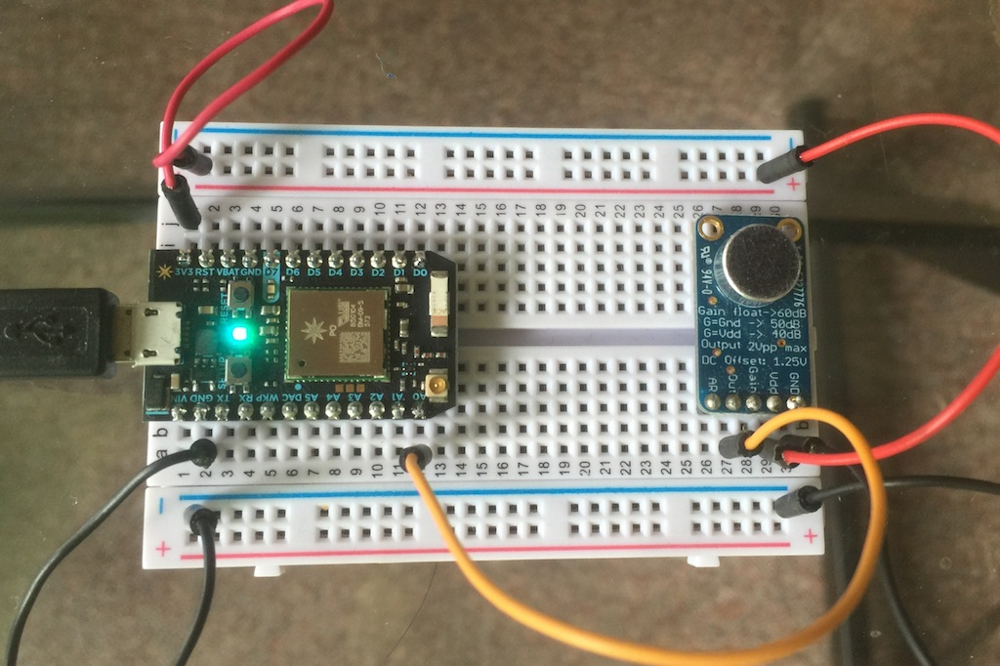

# Photon Audio Sample 3
*Sample program for streaming audio from a Particle Photon to a node.js server over TCP using DMA!*



This simple project uses an [Adafruit 1713] (https://www.adafruit.com/products/1713) Electret Microphone Amplifier - MAX9814 with Auto Gain Control to capture audio on the Photon, then sends the data via TCP to a server.

I used a local server running node.js to receive and process the files in this case, but the data rate is only 64K bytes/second so it should work over the Internet, as well.

Because of the efficiency of having the processor do all of the work using hardware timers and DMA, it easily runs sampling at 32000 Hz with 16-bit samples!

## Photon Side

The connections from the microphone board are:

* AR   - No connection
* Out  - Audio out (analog) to Photon A0
* Gain - No connection
* VDD  - 3V3
* GND  - GND

Then you just need to flash the [audio3.cpp] (https://github.com/rickkas7/photonAudio/blob/master/audio3/audio3.cpp) file to your Photon. Make sure you edit the IP address of your server! 

The code has many comments and should be self-explanatory.

I should warn you that this code is quite experimental as I only just learned how to do this crazy DMA audio stuff on the Photon. There might be better ways to do this, but it does work and might be a good starting point if you want to do this.

I found [this code example] (https://my.st.com/public/STe2ecommunities/mcu/Lists/cortex_mx_stm32/Flat.aspx?RootFolder=https%3a%2f%2fmy%2est%2ecom%2fpublic%2fSTe2ecommunities%2fmcu%2fLists%2fcortex_mx_stm32%2fstm32f207%20ADC%2bTIMER%2bDMA%20%20Poor%20Peripheral%20Library%20Examples&FolderCTID=0x01200200770978C69A1141439FE559EB459D7580009C4E14902C3CDE46A77F0FFD06506F5B&currentviews=6249) on the Internet and it was invaluable. 

The [STM32 standard peripheral library] (http://www.st.com/content/st_com/en/products/embedded-software/mcus-embedded-software/stm32-embedded-software/stm32-standard-peripheral-libraries.html) documentation for the STM32F2xx is also quite helpful.

The idea is that instead of having a timer that kicks off for every sample, you just set up the ADC, Timer and DMA once, and tell the hardware to go to town. The hardware grabs the samples continuously without using the main processor.

From the main loop we poll to see if there's a buffer ready to be transmitted, do some light processing of the data and send it off. The good part is that this is not particularly timing-sensitive.


## Server Side

The server-side code is written in [node.js] (https://nodejs.org). You'll want to copy the [audioserver.js] (https://github.com/rickkas7/photonAudio/blob/master/audio3/audioserver.js) file to your computer. 

It requires the standard Node 4.5.0 features plus the [wav package] (https://github.com/TooTallNate/node-wav) to output the audio files. You install it using:

```
npm install wav
```

Then you run the server:

```
node audioserver.js
```

A directory called out will be created in the same directory and will contain audio files like 00001.wav, 00002.wav, etc.. You should be able to play these on your computer.


## Using It

With the code loaded on the Photon and the server running, hit the SETUP button to being recording. The blue D7 LED turns on after a connection is made to the server. Recording stops when you hit the SETUP button again, or the maximum recording time is reached. That's currently 30 seconds, but there's really nothing on either side that requires that limit. It could be hours if you wanted it to be.

